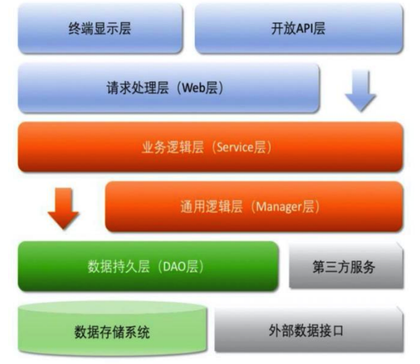

---
# 这是文章的标题
title: 后端到底要干啥？
# 这是页面的图标
icon: file
# 这是侧边栏的顺序
order: 1
# 设置作者
author: Xmerge
# 设置写作时间
date: 2023-11-29
# 一个页面可以有多个分类
category:
  - 后端
  - Spring Boot
# 一个页面可以有多个标签
tag:
  - 后端
  - Spring Boot
# 此页面会在文章列表置顶
sticky: true
# 此页面会出现在文章收藏中
star: true
---

在开始记录Spring Boot开发之前，我们先来对后端开发进行大致的梳理，对后端开发中的各个部分、技术路线和名词有初步了解，在正式开始学习之前做好准备。

<!-- more -->

## 后端开发的目标

后端是指在一个软件系统中负责处理数据和业务逻辑的部分。它通常是与前端相对应的一部分，负责处理**用户请求**、**与数据库交互**、**执行业务逻辑**、**生成响应**等任务。
后端常见的任务如下：

- 数据处理和存储：后端负责处理用户提交的数据，并进行验证、转换和存储。它可能需要与数据库进行交互，执行查询、插入、更新和删除等操作。
- 业务逻辑执行：后端实现了软件系统的核心业务逻辑。它处理用户请求、执行复杂的计算和操作，根据需求生成响应。这包括处理用户身份验证、权限控制、数据验证和处理、业务规则的执行等。
- API开发：后端提供API（Application Programming Interface）供其他系统或客户端应用程序使用。通过定义和实现API，后端允许其他系统与它进行交互，并通过API传递数据和执行操作。
- 安全性和身份验证：后端负责保护系统的安全性和用户数据的机密性。它可以实施各种安全措施，例如用户身份验证、访问控制、数据加密等，以确保系统和用户数据的安全。
- 性能优化和扩展性：后端需要考虑系统的性能和可扩展性。它可以采取各种措施，例如优化数据库查询、缓存数据、异步处理任务、水平扩展等，以提高系统的性能和可伸缩性。
- 错误处理和日志记录：后端需要捕获和处理错误，并记录日志。它可以通过实施错误处理机制、异常处理和日志记录来跟踪系统中的问题，以便进行故障排除和系统改进。

## Web开发模式

前后端分离：前端负责UI展示，后端负责业务逻辑处理。

- 前后端分离的好处：前端可以专注于UI展示，后端可以专注于业务逻辑处理。
- 前后端分离的坏处：前后端分离会增加开发的复杂度。

Spring Boot的优势：

- 内嵌式容器简化Web项目：Spring Boot内嵌了Tomcat容器，可以直接运行。
- 自动配置：Spring Boot会根据你添加的依赖自动配置你的项目。
- 自动装配：Spring Boot会根据你添加的依赖自动配置你的项目。

## 后端开发工程结构

在[阿里巴巴Java开发手册](https://github.com/alibaba/p3c/tree/master)中，对推荐分层结构作出了描述，如图所示。

- 开放 API 层：可直接封装 Service 接口暴露成 RPC 接口；通过 Web 封装成 http 接口；网关控制层等。
- 终端显示层：各个端的模板渲染并执行显示的层。当前主要是 velocity 渲染，JS 渲染，JSP 渲染，移动端展示等。
- Web 层：主要是对访问控制进行转发，各类基本参数校验，或者不复用的业务简单处理等。
- Service 层：相对具体的业务逻辑服务层。
- Manager 层：通用业务处理层，它有如下特征
1）对第三方平台封装的层，预处理返回结果及转化异常信息，适配上层接口。
2）对 Service 层通用能力的下沉，如缓存方案、中间件通用处理。
3）与 DAO 层交互，对多个 DAO 的组合复用。
- DAO 层：数据访问层，与底层 MySQL、Oracle、Hbase、OceanBase等进行数据交互。
- 第三方服务：包括其它部门 RPC 服务接口，基础平台，其它公司的 HTTP 接口，如淘宝开放平台、支付宝付款服务、
高德地图服务等。
- 外部数据接口：外部（应用）数据存储服务提供的接口，多见于数据迁移场景中。

这也就对应了Spring Boot工程结构中常见的几个包（文件夹），如Controller、Service、Dao等。
说到这里，我们顺便了解一下Java开发中常见的几个“O”。

## Java开发中常见的几个“O”

按照上节介绍，分层之后，每一层都有自己的领域模型，即不同类型的 Bean：
同样按照[阿里巴巴Java开发手册](https://github.com/alibaba/p3c/tree/master)，对各层对领域模型做出了解释和规范：

- **DO**（Data Object）：此对象与数据库表结构一一对应，通过 DAO 层向上传输数据源对象。
  DO对象与数据库表结构一一对应，用于在数据访问层（DAO）和数据库之间传输数据。DO对象通常是通过ORM（对象关系映射）工具从数据库中读取的实体对象。DO对象的设计目标是与数据库表结构保持一致，它们主要用于数据持久化。
- **DTO**（Data Transfer Object）：数据传输对象，Service 或 Manager 向外传输的对象。
  TO对象通常是根据业务需求而设计的，能够满足特定数据传输的需要。<u>_DTO对象可以封装多个DO对象的数据_</u>，以提高传输效率和避免不必要的数据暴露。
- **BO**（Business Object）：业务对象，可以由 Service 层输出的封装业务逻辑的对象。
  BO对象通常在Service层中使用，用于实现业务逻辑的封装和处理。BO对象可以包含多个DO对象和其他业务相关的数据和方法。它们帮助将业务逻辑从其他层（如数据访问层）中分离出来，使代码更易于理解和维护。
- **Query**：数据查询对象，各层接收上层的查询请求。注意超过 2 个参数的查询封装，禁止使用 Map 类来传输。
- **VO**（View Object）：显示层对象，通常是 Web 向模板渲染引擎层传输的对象。
  VO对象根据前端页面的需求进行设计，可以封装多个DTO对象或其他数据对象，以提供前端页面展示所需的数据。

::: tip 为什么会有这么多“O”？

  1. 领域模型的划分，是为了更好的划分业务逻辑，更好的复用代码。
  2. 分层架构的设计原则推荐将职责分离并进行**解耦**。不同的领域模型可以将不同层之间的职责明确分离，使各层的代码具备高内聚性和低耦合性。这样可以提高代码的可维护性、可扩展性和可测试性，同时也有助于团队协作和代码的清晰性。
:::
