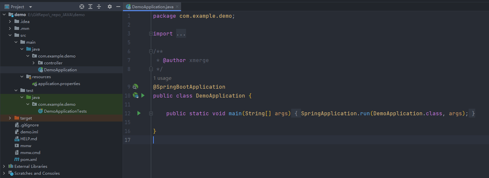

---
# 这是文章的标题
title: Spring Boot 入门
# 这是页面的图标
icon: file
# 这是侧边栏的顺序
order: 1
# 设置作者
author: Xmerge
# 设置写作时间
date: 2023-09-13
# 一个页面可以有多个分类
category:
  - 后端
  - Spring Boot
# 一个页面可以有多个标签
tag:
  - 后端
  - Spring Boot
# 此页面会在文章列表置顶
sticky: true
# 此页面会出现在文章收藏中
star: true
---

这是一篇关于[`Springboot`](https://spring.io/projects/spring-boot)的学习笔记。
本笔记不是完整的Springboot学习教程，如需系统性学习，请移步[官网文档](https://spring.io/projects/spring-boot#learn)或其它教程。
本笔记主要参照[芋道源码](https://www.iocoder.cn/Spring-Boot/good-collection/?side)和[程序猿DD-Springboot2教程](https://www.didispace.com/spring-boot-2/)。
虽然现在Springboot版本已经更新到3，但鉴于Springboot2的学习资料更丰富，本笔记只按照Springboot2特性进行学习。

<!-- more -->

## Spring Boot简介

Spring Boot让我们的Spring应用变的更轻量化。比如：你可以仅仅依靠一个Java类来运行一个Spring应用。
你也可以打包你的应用为jar并通过使用java -jar来运行你的Spring Web应用。

Spring Boot的主要优点：

- 为所有Spring开发者更快的入门
- 开箱即用，提供各种默认配置来简化项目配置
- 内嵌式容器简化Web项目
- 没有冗余代码生成和XML配置的要求

## Spring家族

Spring框架是一个非常强大和流行的Java框架,它包含了许多子项目和模块,组合在一起称为Spring全家桶。

> Spring 是一个开源的应用程序框架，用于构建企业级 Java 应用程序。
它提供了一种轻量级的开发方式，使得开发者能够更容易地构建可扩展的应用程序。
Spring 的核心原则是**依赖注入**(`DI`, Dependency Injection)和**面向切面编程**(`AOP`, Aspect-Oriented Programming)。

Spring 全家桶是指一系列构建在 Spring 框架之上的项目和扩展，它们提供了丰富的功能和解决方案，用于开发不同类型的应用程序。
下面是 Spring 全家桶中一些常用的组件和模块：

- **Spring Boot**: 一个用于快速构建独立的、基于 Spring 的应用程序的框架。它简化了 Spring 应用程序的配置和部署，并提供了自动化的依赖管理，使得开发者能够更专注于业务逻辑的开发。
- **Spring MVC**: Spring 框架中的一个模块，用于构建 Web 应用程序。它采用了经典的 `MVC`（Model-View-Controller）模式，将应用程序的逻辑分为模型、视图和控制器，提供了强大的处理请求和生成响应的能力。
- **Spring Data**: 一个用于简化数据访问的项目，它提供了统一的数据访问抽象层，使得开发者可以更方便地与各种数据存储（如关系数据库、NoSQL 数据库等）进行交互。
- **Spring Security**: pring 框架的安全性解决方案，用于处理认证和授权。它提供了一套强大而灵活的安全性功能，可用于保护 Web 应用程序和服务。
- **Spring Cloud**: 用于构建分布式系统和微服务架构的一套工具和框架。它提供了服务发现、负载均衡、配置管理、熔断器等功能，使得开发者能够更方便地构建和管理分布式系统。

## 快速入门与配置详解

### 1. 创建基础项目

Spring官方提供了非常方便的工具Spring Initializr来帮助我们创建Spring Boot应用。

关于创建项目，本笔记不做详细记录，其他创建SpringBoot项目的教程详见：

- [创建项目步骤(程序员DD)](https://www.didispace.com/spring-boot-2/1-2-quick-start.html#%E5%BF%AB%E9%80%9F%E5%85%A5%E9%97%A8)
- [创建项目步骤(芋道源码)](https://www.iocoder.cn/Spring-Boot/quick-start/?self)

### 2. 项目结构解析



初始化后，项目中包含上图的文件结构（名称可能因版本和配置而存在差异）。

`src/main/java`: 目录下包含程序入口：`DemoApplication`
`src/main/resources`: 目录下包含配置文件：`application.properties`
`src/test`: 目录下包含测试入口：`DemoApplicationTests`
`pom.xml`: pom(Project Object Model) 是Maven项目的核心配置文件，用于描述项目的依赖关系、构建配置和其他信息。

除此之外，笔者还添加了一个名为controller的文件夹，此文件夹的作用将在后文详细解释。

### 3. `pom.xml`: Maven配置

打开`pom.xml`，文件内容如下：

```xml
<?xml version="1.0" encoding="UTF-8"?>
<project xmlns="http://maven.apache.org/POM/4.0.0" xmlns:xsi="http://www.w3.org/2001/XMLSchema-instance" xsi:schemaLocation="http://maven.apache.org/POM/4.0.0 http://maven.apache.org/xsd/maven-4.0.0.xsd">
    <modelVersion>4.0.0</modelVersion>
    <parent>
        <groupId>org.springframework.boot</groupId>
        <artifactId>spring-boot-starter-parent</artifactId>
        <version>2.1.3.RELEASE</version>
        <relativePath/> <!-- lookup parent from repository -->
    </parent>
    <groupId>com.didispace</groupId>
    <artifactId>chapter1-1</artifactId>
    <version>0.0.1-SNAPSHOT</version>
    <name>chapter1-1</name>
    <description>Demo project for Spring Boot</description>

    <properties>
        <java.version>1.8</java.version>
    </properties>

    <dependencies>
        <dependency>
            <groupId>org.springframework.boot</groupId>
            <artifactId>spring-boot-starter-web</artifactId>
        </dependency>

        <dependency>
            <groupId>org.springframework.boot</groupId>
            <artifactId>spring-boot-starter-test</artifactId>
            <scope>test</scope>
        </dependency>
    </dependencies>

    <build>
        <plugins>
            <plugin>
                <groupId>org.springframework.boot</groupId>
                <artifactId>spring-boot-maven-plugin</artifactId>
            </plugin>
        </plugins>
    </build>
</project>
```

主要包含四个部分：

- `parent`: 继承spring-boot-starter-parent的依赖管理，控制版本与打包等内容
- `项目元数据`: 创建时候输入的Project Metadata部分，也就是Maven项目的基本元素，包括：groupId、artifactId、version、name、description等
- `properties`: 定义Java版本
- `dependencies`: 项目具体依赖，这里包含了spring-boot-starter-web用于实现HTTP接口（该依赖中包含了Spring MVC）；spring-boot-starter-test用于编写单元测试的依赖包。更多功能模块的使用我们将在后面的教程中逐步展开
- `build`: 构建配置部分。默认使用了spring-boot-maven-plugin，配合spring-boot-starter-parent就可以把Spring Boot应用打包成JAR来直接运行

### 4. `application.properties`: SpringBoot配置

- 配置基础
  `src/main/resources`是SpringBoot的配置目录，我们可以在其中添加`application.properties`来添加配置文件，除此之外，也可以使用YAML文件格式来配置。
  以下是两段相同含义的application.properties配置定义和YAML定义：

  ```properties
  environments.dev.url=http://dev.bar.com
  environments.dev.name=Developer Setup
  environments.prod.url=http://foo.bar.com
  environments.prod.name=My Cool App
  ```

  ```yml
  environments:
      dev:
          url: http://dev.bar.com
          name: Developer Setup
      prod:
          url: http://foo.bar.com
          name: My Cool App
  ```

- 自定义参数

  我们除了可以在Spring Boot的配置文件中设置各个Starter模块中预定义的配置属性，也可以在配置文件中定义一些我们需要的自定义属性。比如在`application.properties`中添加：

  ```properties
  book.name=SpringCloudInAction
  book.author=ZhaiYongchao
  ```

  然后在应用中通过`@value`注解来加载这些自定义的参数，比如：

  ```java
  @Component
  public class Book {
      @Value("${book.name}")
      private String name;
      @Value("${book.author}")
      private String author;
      // 省略getter和setter
  }
  ```

  > @Value注解加载属性值的时候可以支持两种表达式来进行配置：
      1. PlaceHolder方式(如上所示)，格式为 ${...} ，大括号内为PlaceHolder
      2. SpEL表达式(Spring Expression Language)， 格式为 #{...} ，大括号内为SpEL表达式

- 参数引用

  在application.properties中的各个参数之间，我们也可以直接通过使用PlaceHolder的方式来进行引用，就像下面的设置：

  ```properties
  book.name=SpringBoot
  book.author=Xmerge
  book.desc=${book.author}  is writing${book.name}
  ```

  最终`book.desc`值为`Xmerge is writing SpringBoot`

- 使用随机数

  在一些特殊情况下，有些参数我们希望它每次加载的时候不是一个固定的值，比如：密钥、服务端口等。
  我们可以通过使用${random}配置来产生随机的int值、long值或者string字符串：

  ```properties
  # 随机字符串
  com.didispace.blog.value=${random.value}
  # 随机int
  com.didispace.blog.number=${random.int}
  # 随机long
  com.didispace.blog.bignumber=${random.long}
  # 10以内的随机数
  com.didispace.blog.test1=${random.int(10)}
  # 10-20的随机数
  com.didispace.blog.test2=${random.int[10,20]}
  ```

  该配置方式可以用于设置应用端口等场景，避免在本地调试时出现端口冲突的麻烦。

- 命令行参数

  使用命令`java -jar`命令来启动SpringBoot应用，除此之外，还可以用类似于`java -jar xxx.jar --server.port=8888`的命令来指定端口号。
  这等价于在`application.properties`文件中添加属性`server.port=8888`

- 多环境配置

  我们在开发任何应用的时候，通常同一套程序会被应用和安装到几个不同的环境，比如：开发、测试、生产等。其中每个环境的数据库地址、服务器端口等等配置都会不同，如果在为不同环境打包时都要频繁修改配置文件的话，那必将是个非常繁琐且容易发生错误的事。
  对于多环境的配置，各种项目构建工具或是框架的基本思路是一致的，通过配置多份不同环境的配置文件，再通过打包命令指定需要打包的内容之后进行区分打包，Spring Boot也不例外，或者说更加简单。

  在Spring Boot中多环境配置文件名需要满足`application-{profile}.properties`的格式，其中`{profile}`对应你的环境标识，比如：
  - `application-dev.properties`：开发环境
  - `application-test.properties`：测试环境
  - `application-prod.properties`：生产环境

  至于哪个具体的配置文件会被加载，需要在`application.properties`文件中通过`spring.profiles.active`属性来设置，其值对应配置文件中的{profile}值。
  比如，`spring.profiles.active=test`就会加载`application-test.properties`配置文件内容。
